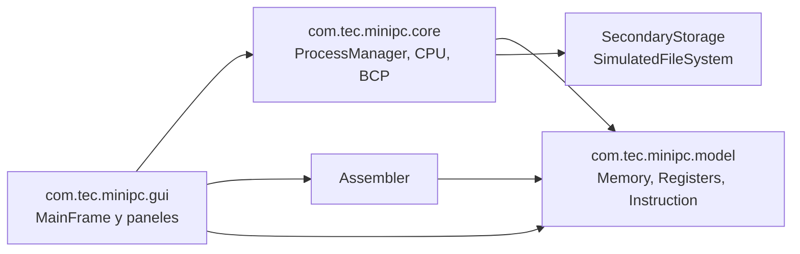

Quiriat Mata

# Gestor de procesos - Mini PC

Simulador de una minicomputadora para el curso IC-6600 Principios de Sistemas Operativos. La interfaz permite cargar hasta cinco programas `.asm`, observar sus procesos y avanzar la CPU en pasos de un segundo simulado o ejecutar todos los trabajos.

## Estado del proyecto

Implementado: ensamblador y validación de programas, ejecución de instrucciones y pesos, memoria principal dividida entre kernel y usuario, BCP enlazados, cola FCFS, espera por memoria, pila por proceso, pantalla y teclado simulados, almacenamiento secundario configurable, páginas virtuales, llamadas de archivo `INT 21H`, estadísticas y controles de protección.

Pendiente antes de la entrega: completar la verificación integral desde NetBeans con varios programas, elaborar y exportar el diagrama de paquetes/diseño a PDF solicitado por el curso, grabar el video explicativo y agregar su enlace aquí.

## Configuración

Los valores se cargan y guardan en `simulador.properties`, en el directorio de ejecución:

- Memoria principal: 256 celdas por defecto.
- Kernel: 25% de la memoria por defecto.
- Disco secundario: 512 celdas por defecto.
- Memoria virtual: 64 páginas por defecto, con 8 bytes por página.

También se pueden cambiar desde la ventana del simulador; use **Guardar configuración** para persistirlos. El espacio de disco contiene el índice de programas en sus primeras celdas, las imágenes ejecutables, los datos de archivos y la tabla de páginas virtuales.

## Llamadas a archivos `INT 21H`

El mini ensamblador no tiene segmentos de datos ni literales de cadena. Por eso `DX` lleva un identificador numérico de archivo entre 0 y 255, que se muestra como `archivo_NNN.dat`. `AH` selecciona la función y `AL` lleva o recibe un byte; ambos son vistas de 8 bits del registro `AX`.

| `AH` decimal | Hex | Función |
| ---: | ---: | --- |
| 60 | 3CH | Crear y abrir |
| 61 | 3DH | Abrir archivo existente |
| 62 | 3EH | Cerrar archivo actual |
| 77 | 4DH | Leer un byte en `AL` (0 al llegar al final) |
| 64 | 40H | Escribir el byte de `AL` |
| 65 | 41H | Eliminar archivo cerrado |

El panel **Disco y memoria virtual** muestra los archivos, su contenido de texto, actividad de `INT 21H` y consumo de espacio. El BCP indica el archivo abierto por cada proceso; el sistema cierra automáticamente el archivo si el proceso finaliza con uno abierto.

## Protección

- La memoria separa la zona del kernel de la memoria de usuario; los programas se cargan únicamente en la región de usuario.
- El ensamblador valida los operandos y los destinos de salto antes de admitir un trabajo.
- El CPU comprueba los límites del proceso; un salto fuera del programa finaliza el proceso.
- Cada proceso tiene una pila independiente de capacidad cinco; el desbordamiento o subdesbordamiento marca error y detiene ese proceso.
- Las entradas del teclado se limitan a 0–255. `INT 21H` valida función, identificador, archivo abierto y espacio disponible.
- La interfaz **Seguridad** presenta la estrategia y los errores/llamadas observados durante la simulación.

## Diseño de paquetes

`gui` coordina eventos y representa el estado. `core` aplica planificación FCFS, ejecución, llamadas al sistema y contexto por proceso. `model` define instrucciones, registros y memoria. El ensamblador traduce archivos de entrada al modelo validado antes de que el gestor los admita.

## Ejemplos

Los archivos de ejemplo están en `examples/`. `07_archivos_int21.asm` crea un archivo, escribe `Hi`, lo vuelve a abrir y lee un byte. Los valores inmediatos de este mini ensamblador se expresan en decimal.
